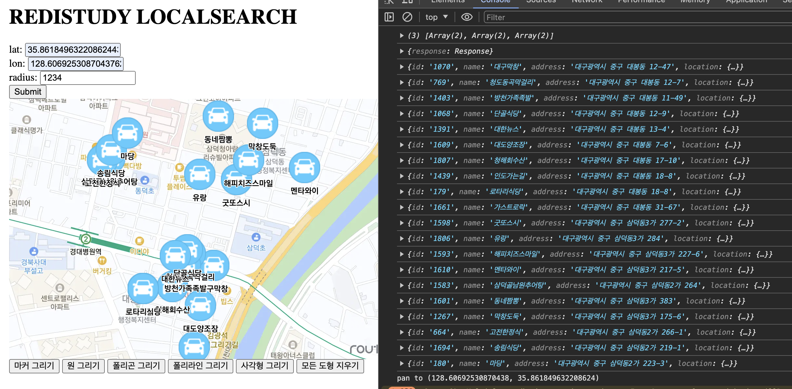

# localsearch

## Overview

- 공공 API 활용
  - [대구 맛집 API](./assets/daegu-restaurant-api-docs.txt)
  - [Geocoding API](https://www.vworld.kr/dev/v4dv_geocoderguide2_s001.do)
- [Routo Web JS 지도 기능 활용](https://www.routo.com/developers/web_js/example/example_list.html)
- Redis 자료구조 활용
  - Hash
  - Geospatial



## Features

- 좌표, 반지름 기준 대구 맛집 주변 검색(sort - order by dist asc)
- routo 서비스를 바탕으로 지도 및 POI 렌더링

## Batch

Batch 시스템은 따로 구성하지 않고, Test 코드 내에서 간단하게 수행

```java
class PublicDataTest {
    
    @Test
    void insertToRedis() {
        Stream.of("중구")
                .map(daeguFood::fetchData)
                .flatMap(Collection::stream)
                .map(restaurant -> {
                    try {
                        var addr = restaurant.getAddr();
                        var addressInfo = geocoding.fetchData(addr);
                        return this.toRestaurant(restaurant, addressInfo.value, addressInfo.point);
                    } catch (Exception e) {
                        log.warn("Failed converting address to coordinates.", e);
                        log.info("Retry converting...");

                        try {
                            var addr = restaurant.getAddr();
                            var addressInfo = geocoding.fetchData(addr);
                            return this.toRestaurant(restaurant, addressInfo.value, addressInfo.point);
                        } catch (Exception e2) {
                            log.warn("Failed converting address to coordinates.", e2);
                        }
                    }

                    return this.toRestaurant(restaurant, restaurant.addr, null);
                })
                .peek(restaurant -> log.info("restaurant: {}", restaurant))
                .map(Restaurant::toPoi)
                .forEach(repository::save);
    }

}
```

## Config

### application.properties

```properties
spring.application.name=localsearch

localsearch.routo.api-key=${ROUTO_API_KEY}

localsearch.public-api.geocoding.base-uri=https://api.vworld.kr/req/address
localsearch.public-api.geocoding.api-key=${GEOCODING_API_KEY}

localsearch.public-api.daegu-food.base-uri=https://www.daegufood.go.kr/kor/api/tasty.html
```

### redis

```java
@Slf4j
@Configuration
class RedisConfig {

    private final String host;

    private final Integer port;

    public RedisConfig(
            @Value("${spring.redis.host:localhost}") final String host,
            @Value("${spring.redis.port:6379}") final Integer port
    ) {
        this.host = host;
        this.port = port;
    }

    @Bean
    RedisConnectionFactory redisConnectionFactory() {
        return new LettuceConnectionFactory(this.host, this.port);
    }

    @Bean
    RedisTemplate<?, ?> redisTemplate() {
        var redisTemplate = new RedisTemplate<>();
        redisTemplate.setConnectionFactory(this.redisConnectionFactory());
        return redisTemplate;
    }

}
```

## Implementation

### Domain

#### PointOfInterest

```java
public record PointOfInterest(
        String id,
        String name,
        String address,
        Point location
) {

    public PointOfInterest {
        if (id == null || id.isBlank()) {
            throw new RuntimeException(new NullPointerException("id is blank."));
        }
        if (name == null || name.isBlank()) {
            throw new RuntimeException(new NullPointerException("name is blank."));
        }
    }

}
```

### Repository

```java
@Slf4j
@Repository
public class RedisPoiRepository {

    private final String LOCATION_GEOSPATIAL_KEY = "location";

    private final HashOperations<String, String, String> poiMetas;

    private final GeoOperations<String, String> poiLocations;

    RedisPoiRepository(final RedisTemplate<String, String> redisTemplate) {
        this.poiMetas = redisTemplate.opsForHash();
        this.poiLocations = redisTemplate.opsForGeo();

        log.info(">>> poiMetas={}", this.poiMetas.getClass());
        log.info(">>> poiLocations={}", this.poiLocations.getClass());
    }

    public void save(final PointOfInterest poi) {
        var metaKey = "poi:" + poi.id();

        String ID_HASH_FIELD = "id";
        this.poiMetas.put(metaKey, ID_HASH_FIELD, poi.id());
        String NAME_HASH_FIELD = "name";
        this.poiMetas.put(metaKey, NAME_HASH_FIELD, poi.name());
        String ADDR_HASH_FIELD = "address";
        this.poiMetas.put(metaKey, ADDR_HASH_FIELD, poi.address());

        if (poi.location() != null) {
            this.poiLocations.add(LOCATION_GEOSPATIAL_KEY, poi.location(), poi.id());
        }
    }

    PointOfInterest findByPoiId(final String poiId) {
        var entries = this.poiMetas.entries("poi:" + poiId);
        var locations = this.poiLocations.position(LOCATION_GEOSPATIAL_KEY, poiId);
        log.info("meta={}, locations={}", entries, locations);

        return new PointOfInterest(
                entries.get("id"),
                entries.get("name"),
                entries.get("address"),
                this.parseLocation(locations));
    }

    Collection<PointOfInterest> findByLocationAndRadius(final Point location, final Double radius) {
        var results = this.poiLocations.search(
                LOCATION_GEOSPATIAL_KEY,
                GeoReference.fromCoordinate(location),
                new Distance(radius),
                newGeoSearchArgs()
                        .sortAscending()
                        .limit(20)
                        .includeDistance()
                        .includeCoordinates());

        if (results == null) {
            log.info("search results=<EMPTY>");
            return Collections.emptyList();
        }

        log.info("search results={}, averageDist={}", results, results.getAverageDistance());

        return results.getContent().stream()
                .map(GeoResult::getContent)
                .map(GeoLocation::getName)
                .map(this::findByPoiId)
                .toList();
    }

    private Point parseLocation(final Collection<Point> locations) {
        if (locations == null || locations.isEmpty()) {
            throw new RuntimeException(new IllegalStateException("location is empty"));
        }
        return locations.iterator().next();
    }

}
```
