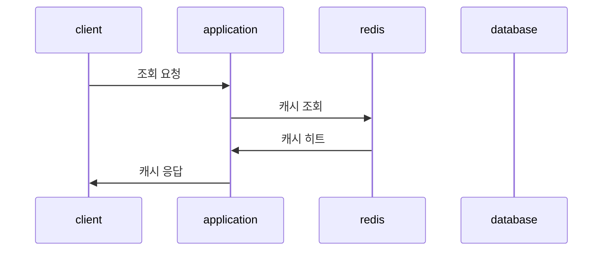
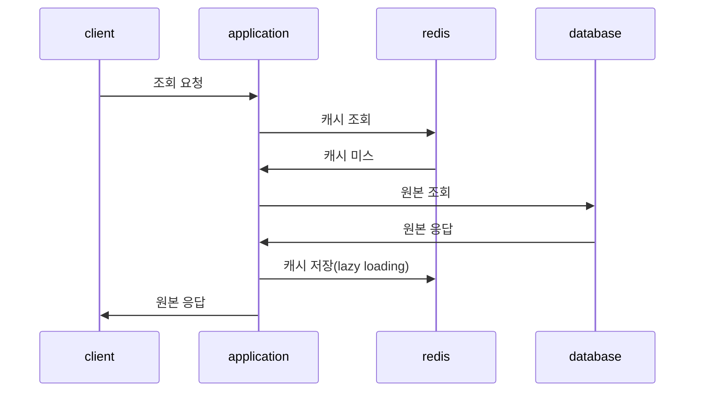
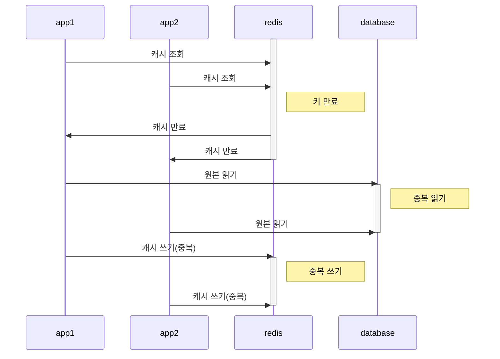
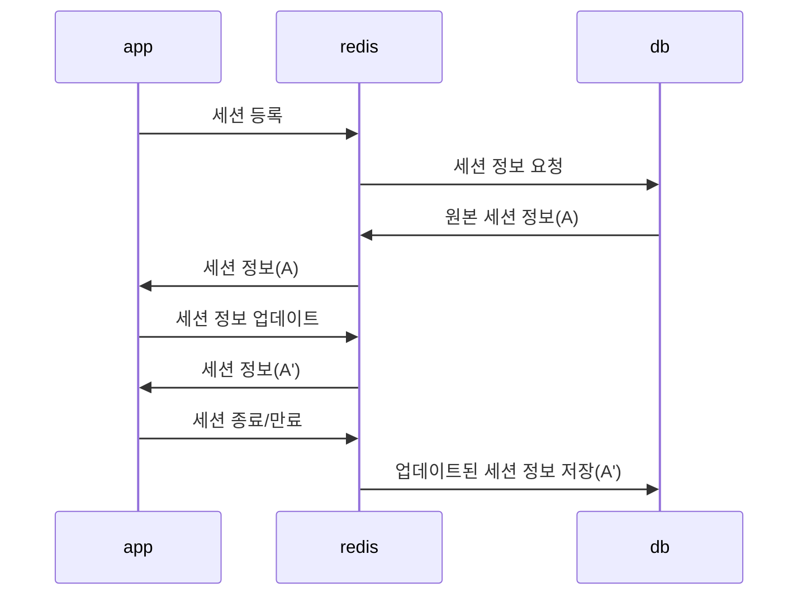

# Chapter 05. 레디스를 캐시로 사용하기

## 1. 레디스와 캐시

### 1) 캐시란?

> 데이터의 원본보다 더 빠르고 효율적으로 엑세스할 수 있는 임시 데이터 저장소

캐시를 도입했을 때 성능이 효과적일 수 있는 조건

* 원본 데이터 저장소에서 원하는 데이터를 찾기 위해
  검색하는 시간이 오래 걸리거나, 매번 계산을 통해 데이터를 가져와야 한다.
* 캐시에서 데이터를 가져오는 것이
  원본 데이터 저장소 데이터를 요청하는 것보다 빨라야 한다.
* 캐시에 저장된 데이터는 잘 변하지 않는 데이터다.
* 캐시에 저장된 데이터는 자주 검색되는 데이터다.

### 2) 캐시로서의 레디스

장점

* 간단
* 다양한 자료구조 지원
* 인메모리 저장소이므로 빠름
* 고가용성 지원(센티널, 클러스터)

### 3) 캐싱 전략

#### (1) 읽기 전략 - look aside





캐시(레디스)에 아무 데이터가 없을 경우,
서비스 시작 시 모든 데이터에 대해 캐시 미스가 발생하고,
원본 데이터를 저장하는 과정에서 서비스 지연이 발생한다.
이에 대한 해결책으로는 캐시 워밍(cache warming) 작업이 있다.

#### (2) 쓰기 전략과 캐시의 일관성

원본 데이터가 변경되었을 경우 이전에 캐시에 저장된 데이터는 그대로이므로
캐시 불일치(cache inconsistency) 현상이 발생한다.

##### a. write through

> 데이터베이스에 업데이트할 때마다 매번 캐시에도 데이터를 함께 업데이트

사용하지 않을 가능성이 큰 데이터도 무조건 캐시에 저장하므로 일종의 리소스 낭비

이 방식을 사용할 경우 데이터 저장 시 만료 시간을 사용할 것을 권장

##### b. cache invalidation

> 데이터베이스에 업데이트할 때마다 매번 캐시에 저장된 데이터를 제거

캐세에 데이터의 저장하는 것보다 삭제하는 것이 리소스 낭비가 적음

##### c. write behind(write back)

> 일차적으로 캐시에만 데이터를 업데이트하고,
> 이후 특정 시간이나 건수에 따라 비동기적으로 데이터베이스에 업데이트

실시간으로 정확한 데이터가 아니어도 되는 경우 유용한 방식

ex) 유튜브와 같은 스트리밍 사이트의 동영상 좋아요 수는
매번 실시간 집계가 필요하지 않음

다만, 5분 마다 데이터를 업데이트한다 가정했을 때
그 사이에 레디스에 문제가 생길 경우 최대 5분 동안의 데이터가 날아갈 수 있다.

## 2. 캐시에서의 데이터 흐름

### 1) 만료 시간; TTL; Time To Live

```shell
# 만료 시간 설정하기
> SET a 100
"OK"

> EXPIRE a 60
(integer) 1

# 2초 뒤
> TTL a
(integer) 58
```

```shell
# 데이터 값 변경 시

# 데이터 값 변경
> INCR s
(integer) 101

> TTL a
(integer) 51

# 데이터 값 변경
> RENAME a apple
"OK"

# 데이터의 값과 키가 변경되어도 만료 시간은 변하지 않음
> TTL apple
(integer) 41
```

```shell
# 데이터 값 재할당 시
> SET b 100
"OK"

> EXPIRE b 60
(integer) 1

> TTL b
(integer) 57

# 데이터 값 재할당
> SET b banana
"OK"

# 기존 만료 시간 사라짐
> TTL b
(integer) -1
```

> 레디스에서 데이터가 만료되었다 해도 바로 메모리에서 삭제되지는 않음.
> * passive 방식:
>   클라이언트가 키에 접근하고자 할 때 키가 만료됐다면 메모리에서 수동 삭제.
>   단순 만료 처리이므로 만약 다시 사용되지 않는 키일 경우,
>   메모리에 계속 남아 있으므로 충분한 방식이 아님.
> * active 방식:
>   TTL 값이 있는 키 중 20개를 랜덤하게 접근하여 만료된 키를 메모리에서 제거.
>   만약 20개 중 5개(25%)가 삭제되었을 경우 다시 20개 선출하여 확인.
>   1초에 10번 수행.

### 2) 메모리 관리와 maxmemory-policy 설정

레디스에서 키에 만료 시간을 설정해 데이터가 자동으로 삭제되도록 함으로써
데이터의 수명을 관리할 수 있다.
하지만 레디스의 메모리는 제한적이기 때문에 모든 키에 만료 시간을 설정해도
너무 많은 키가 저장되면 메모리가 가득 차는 상황이 발생하기 마련.
따라서 메모리의 임계치를 지정하여, 레디스에 저장된 데이터를 삭제하는 정책이
`maxmemory-policy`인 것이다.

#### (1) Noeviction

> 레디스에서 기본값 설정되는 정책

데이터가 가득 차 있는 상태일 때, 새로운 데이터 저장 시도 시 에러 반환

데이터는 안전하겠다만, 서비스에서 캐시로 사용될 경우 장애 유발자임.

관리자가 직접 레디스 데이터를 지워야 해서,
레디스를 캐시로 사용할 때는 권장하지 않은 정책임.

#### (2) LRU eviction; Least-Recently Used

> 데이터가 가득 찼을 때 가장 최근에 사용되지 않은 데이터부터 삭제하는 정책

레디스를 캐시로 사용하는 상황에서 가장 사용되지 않은 데이터 삭제라 꿀임.

* volatile-lru:
  TTL 설정이 된 키에 한해서 LRU 알고리즘 적용해서 제거.
  만료 시간이 설정되지 않은 데이터만 사용할 경우에는 당연히 장애 유발 가능함.
* allkeys-lru:
  레디스를 잘 모르고 쓰는 당신이라면, 대충 이 설정 쓰셈.
  TTL 설정에 관계 없이 모든 키에 대해 LRU 때려서 삭제함.

#### (3) LFU eviction; Least-Frequently Used

> 데이터가 가득 찼을 때 가장 자주 사용되지 않은 데이터부터 삭제하는 정책

자주 사용된 놈은 나중에도 다시 사용될 수 있다는 가정하에 우선순위 정한 것.

* volatile-lfu:
  만료 시간이 설정된 키들을 대상으로 LFU 알고리즘으로 삭제
* allkeys-lfu:
  모든 키를 대상으로 LFU 알고리즘으로 삭제

#### (4) RANDOM eviction

랜덤으로 삭제 후보 키를 선출하기에
LRU/LFU 알고리즘 연산을 안 태워 레디스의 부하를 줄일 수는 있음.

하지만 자주 사용되는 데이터도 지워질 수 있어,
쓰기 정책과 맞물려 오히려 나쁠 수 있음.

* volatile-random:
  만료 시간이 설정된 키들을 대상으로 무작위로 삭제
* allkeys-random:
  모든 키를 대상으로 무작위로 삭제

#### (5) volatile-ttl

> 만료 시간이 가장 작은 키부터 삭제하는 정책

### 3) 캐시 스탬피드 현상; Cache Stampede

레디스를 캐시로 사용할 때에는 모든 키에 대해 만료 시간을 설정하는 것이 권장되지만,
대규모 트래픽 환경에서는 만료 시간 설정에 따라
캐시 스탬피드과 같은 예상치 못한 문제가 발생할 수 있다.



캐시 스탬피드 현상은 DB에 부하를 줄 수 있는 행위이고,
이로 인한 부하로 인해 계산식 실패(cascading failure)가 발생할 수 있다.

#### (1) 적절한 만료 시간 설정

##### a. 선 계산

> 만료 시간을 보고 일정 수치에 도달하면 미리 갱신하는 방식

```python
# asis
def fetch(key):
    value = redis.get(key)
    if (!value):
        value = db.fetch(key)
        redis.set(value)
    return value

# tobe
def fetch(key, expiry_gap):
    ttl = redis.ttl(key)

    if ttl - (random() * expiry_gap) > 0:
        return redis.get(key)
    else:
        value = db.fetch(key)
        redis.set(value, KEY_TTL)
        return value

# tobe usage
value = fetch('hello', 2)
```

캐시 스탬피드 현상을 어느 정도 줄여줄 수 있으나,
expiry_gap 값의 적절함이 가장 중요하다.
이 값에 따라 오히려 불필요한 작업이 늘어나 성능에 영향을 미칠 수 있다.

##### b. PER 알고리즘; Probabilistic Early Recomputation

> 2015년산 비교적 따수운 캐시 스탬피드 완화를 위한 확률적 조기 계산 알고리즘

```python
currentTime - (timeToCompute * beta * log(rand())) > expiry
```

* currentTime: 현재 남은 만료 시간
* timeToCompute: 캐시된 값을 다시 계산하는 데 걸리는 시간
* beta: 기본적으로 1.0보다 큰 값으로 설정 가능(상수)
* rand: 0과 1 사이의 랜덤 값
* expiry: 키를 재설정할 때 새로 넣어줄 만료 시간

아무튼 적용하면 좋다는 것.

### 3) 세션 스토어로서의 레디스

#### (1) 세션이란?

> 서비스를 사용하는 클라이언트의 상태 정보

#### (2) 세션 스토어가 필요한 이유

각 췝 서버별 세션 스토어를 따로 관리한다면 유저는 세션 정보를 가지는
특정 하나의 웹 서버에 종속적이다.
이 때, 클라이언트이 요청이 특정 서버로만 가는 게 아니므로 정합성 유지가 필요.

```text
# using hash
+---------------+---------+--------------+------+----------+
|      key      |   name  |       id     | hits | lastPage |
+---------------+---------+--------------+------+----------+
| usersession:1 | Garimoo | 10:20:104:30 |   2  |          |
+---------------+---------+--------------+------+----------+
| usersession:2 |  JiHee  | 10:20:104:31 |   3  |   home   |
+---------------+---------+--------------+------+----------+
```

```shell
> HMSET usersession:1 name Garimoo IP 10:20:104:30 Hits 1
"OK"

> HINCRBY usersession:1 Hits 1
1) "2"
```

#### (3) 캐시와 세션의 차이

캐시는 원본 데이터베이스에 대한 완벽한 서브셋으로서 동작.

세션과 캐시는 임시로 데이터를 가지는 것 형태는 동일하나,
세션은 사용자 간 공유되지 않고 특정 사용자 ID에 유효하다.



세션이 만료될 경우, 서비스에 따라 정보 업데이트를 수행한다.

세션 스토어의 경우 그 데이터가 유일한 상태일 수 있으므로,
레디스를 캐시로 사용할 때보다 신중하게 운영할 필요가 있다.

ex) 쇼핑몰 서비스에서 장바구니 정보의 경우 세션이 만료되면 한 번에 업데이트하여
다음 로그인 시 장바구니 정보를 확인할 수 있도록 한다.
